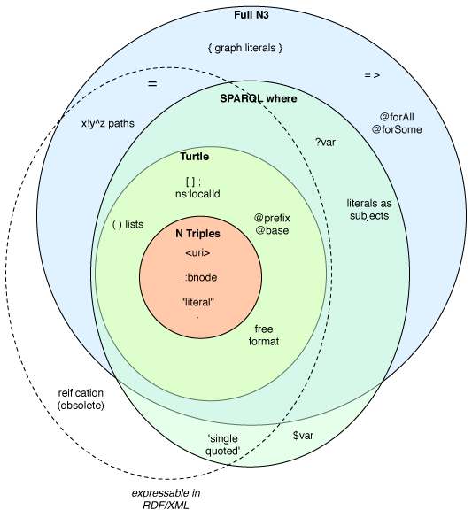

#1	Resource Description Framework

Resource Description Framework (from here on referred to as simply `RDF`)
is `W3C` specification for description and modeling of objects, their
relationships and properties. Data stored in RDF format is formed by
`TRIPLET: SUBJECT - PREDICAMENT - OBJECT`. The triplet tells us:

    "SUBJECT has property PREDICAMENT and the predicament has value of
    OBJECT"

For storing RDF data the special storage techniques and tools were
designed, which allows additional functions such as querying, inserting or
deleting the data inside.

The other rather interesting property of RDF is ability to deduce
additional information - in simplicity it is creation of triplets not
(physically) existing in the RDF storage.

##1.1	Relationship with the Semantic Web

Semantic web is all about the data. On the internet there are large
quantities of the data available in different forms. The most dominant
forms are still texts, images and tables. Those are easy to understand for
human, as he draws his own logical conclusions about the data and links
them together.

Machines do not possess such ability to do logical deductions, so how it
can then recognize relationships between information? This exact problem
is challenged by `Semantic Web`.

The basic principle is to complement the in human readable form (text,
image ...) by metadata. And from the metadata the machine will determine
relationships between objects.

The semantic web development is driven by the World Wide Web Consortium
and it's technologies specifications contains specification for `RDF` and
`OWL`.

##1.2	RDF as a graph
At the data represented in `RDF metadata` we can look as on oriented
graph. The root node is represented by subject, edge is predicament and
the result node is object. The nodes can be of following types:
    * Entities (has its own definition in dictionary, has its own URI)
    * Literals
    * Blank nodes (not identified by URI)

##1.3	RDF serialization formats

For exchanging the `RDF metadata` there are numerous file formats in use.
The main focus of this thesis in on the  `Notation 3` and particularly
it's subset: `Turtle`, `N-Triples` and `N-Quads`. Other well known formats
are: `RDF/XML`, `RDF/JSON`, `TriG`. For the following discussion about
each format the following example metadata will be used:

| OBJECT | PERDICAMENT | SUBJECT |
| -- | -- | -- |
|ex:schools#VSB	|ex:studiesAt |	ex:Student |
|"xyz123" |	ex:login | ex:Student |
| ex:Student | ex:teaches | ex:Profesor |

###1.3.1 RDF/XML
Primary format for the data specified in `W3C` documents in 1999 for semantic web RDF description.
```xml
<?xml version="1.0" encoding="UTF-8"?>
<rdf:RDF
	xmlns:rdf="http://www.w3.org/1999/02/22-rdf-syntax-ns#"
	xmlns:ex="http://example.com/#">

	<rdf:Description rdf:about="http://example.com/Student">
      <ex:studiesAt>http://example.com/schools#VSB</ex:studiesAt>
      <ex:login>xyz123</ex:login>
	</rdf:Description>

	<rdf:Description rdf:about="http://example.com/Profesor">
      <ex:teaches>http://example.com/Student</ex:teaches>
	</rdf:Description>
</rdf:RDF>
```

###1.3.2 RDF/JSON
Based on format which drives `Web 2.0`. `JSON` notation was specified for
javaScript objects ( hence the name JSON - JavaScript Object Notation). It
gained popularity in recent years and therefore it should not be supprise
to anyone that it's used as alternative to more verbose `RDF/XML` syntax

```json
{
  "http://example.org/Student" : {
    "http://example.org/#studiesAt" :
       [
            {
                "value" : "http://example.com/schools#VSB",
                "type"  : "uri"
            }
       ],
    "http://example.org/#login" :
       [
            {
                "value" : "xyz123",
                "type"  : "literal"
            }
       ]
  },
  "http://example.org/Profesor" : {
    "http://example.org/#teaches" :
       [
            {
                "value" : "http://example.com/Student",
                "type"  : "uri"
            }
       ]
  }
}
```

###1.3.3 Turtle
Subset of the `Notation 3` syntax omitting some less common construction
such as implication (`=>`) and keywords such as `has`. Currently most
common alternative to the `RDF/XML` syntax.

```ruby
@prefix ns0: <http://example.com/#> .

<http://example.com/Student>
  ns0:studiesAt "http://example.com/schools#VSB" ;
  ns0:login "xyz123" .

<http://example.com/Profesor> ns0:teaches "http://example.com/Student" .
```

###1.3.3 N-Triples
The subset of the `Turtle` notation simplifying it's syntax and omitting
more complex construction in favor of very simple triple syntax.

```xml
<http://example.com/Student> <http://example.com/#studiesAt> "http://example.com/schools#VSB" .
<http://example.com/Student> <http://example.com/#login> "xyz123" .
<http://example.com/Profesor> <http://example.com/#teaches> "http://example.com/Student" .
```

As is seen from those examples, the `N3` based examples are much easier to
read to human.


